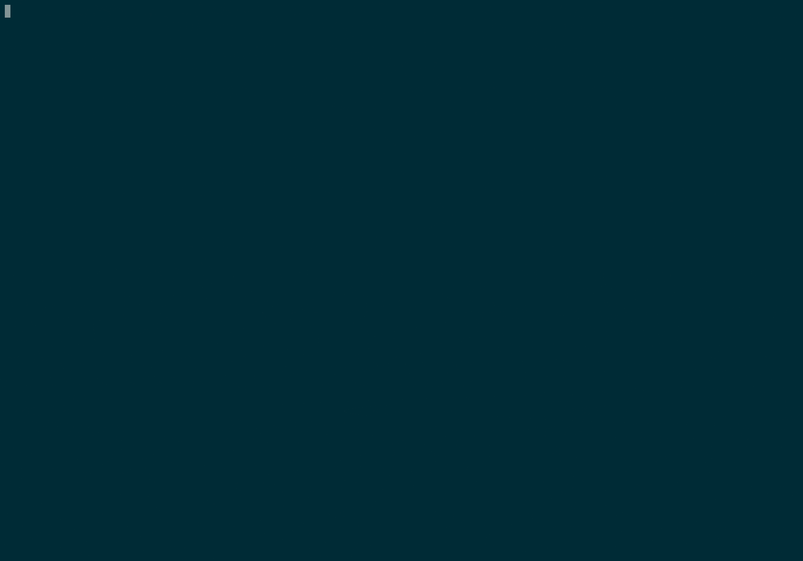

# Adabas RESTful administration client

This code contains a sample use case of Adabas RESTful administration.
The Swagger definition delivered in the Adabas RESTful administration server can be used to
generate a RESTful clients.

The example shows, how Adabas administration tasks can be generated using swagger generators.
This examples uses the programming language GO but you can use  the Swagger definition with other programming languages like Angular, Python or specific Java frameworks as well.

This example can be generated using GO 1.8 or higher.

The result is a command line access to the Adabas RESTful administration.

## Build

The build process needs an installed GO (golang) compiler. The build works on Linux. Any it is possible to build Windows version using the `GOOS=windows` parameter. The build-infrastructure of GO requires web access to download required dependencies.

The command line is generated using

```bash
make
```

You can regenerate sources out of swagger definitions by using

```bash
make generate
```

Except the `cmd` directory, all other directories
contain generated source.

## Generate binaries

The binary are located in the corresponding `bin/${GOOS}_${GOARCH}` directory. You can create cross operating system binaries. On Linux the `make` command will generate a Linux binary call `client`.

If you'd like to generate a Windows binary, you need to provide an additional environment variable `GOOS`. For example to build for Windows, following command need to be entered.

```bash
make GOOS=windows
```

The final platform is independent to the platform Adabas is working.

## Runtime

Beside the direct usage of the client you might use the `startAdmin.sh` script for a quick start.  In this case it might be necessary to import dependent packages using the `go get <package>` command. The `startAdmin.sh` script provides all help descriptions entering the  `help` command.

The client has a `-url` option.
This option can be used to reference the REST server location. It is possible to use `<host>:<port>` to specify a HTTP access. To connect to an HTTPS connection, the URL need to specifiy the SSL connection with `https://<host>:<url>`. A preset URL can be set using the environment variable `ADABAS_ADMIN_URL`. To omit entering the password for each request, you can set the environment `ADABAS_ADMIN_PASSWORD`.

If the certificate is for internal use without public certification, you may switch off validation using the `-ignoreTLS` switch.

## List Adabas databases

This will list all available databases on the remote server.



```sh
client -url <host>:<port> list
```

Example output would be like this

```sh
2018/10/10 12:40:54 Adabas Administration RESTful client started

2018/10/10 12:40:54 Server: linhost:8390
2018/10/10 12:40:54 User:   admin

Enter Password:
 Dbid   Name                  Active    Version

  001 [TestDatabase    ]      false    Adabas v6.6 (20)
  015 [SAMPLE_DB       ]      false    Adabas v6.6 (20)
  050 [GENERAL_DATABASE]      false    Adabas v6.5 (19)
  075 [GENERAL_DATABASE]      false    Adabas v6.7 (21)
  102 [GENERAL_DATABASE]      false    Adabas v6.6 (20)
  155 [SAMPLE_DB       ]      false    Adabas v6.7 (21)
  195 [DEMODB          ]      false    Adabas v6.7 (21)


2018/10/10 12:40:57 Adabas Administration RESTful client took 61.262267ms terminated
```

## Adabas database information

With `-dbid` and `-fnr` you may define corresponding database parameter.

```sh
client -url <host>:<port> -dbid <dbid> -fnr <fnr> file
```

Example output would be like this

```sh
2018/10/10 12:59:12 Adabas Administration RESTful client started

2018/10/10 12:59:12 Server: linhost:8390
2018/10/10 12:59:12 User:   admin

Enter Password:

Database 195 file 011:

Name                : EMPLOYEES-NAT
Number              : 11
Last modification   : 2014-Jul-15 15:46:10:000 UTC
Flags               : ISN_REUSAGE,SPACE_REUSAGE
ISN count           : 1,107
Top ISN             : 1,108
Maximum ISN         : 73,727
Max.MU Occurence    : 0
Padding factor ASSO : 5
Padding factor DATA : 5
Max.record length   : 32,764
Structure level     : 4
Root file           : 0
Lob file            : 0
Record count        : 1,107
Security info       : 0
AC extents
 - First RABN   : 2,574
   Last RABN    : 2,582
   Free or Isn  : 0
DS extents
 - First RABN   : 267
   Last RABN    : 298
   Free or Isn  : 275
NI extents
 - First RABN   : 229
   Last RABN    : 318
   Free or Isn  : 255
UI extents
 - First RABN   : 319
   Last RABN    : 333
   Free or Isn  : 332

2018/10/10 12:59:14 Adabas Administration RESTful client took 102.136227ms terminated
```

## Parameter usage example

You may provide parameter to perform special operations. For example to set new Adabas parameters, the parameter need to be passed using the `-param` parameter. To list all current database on the Adabas server node use

Dynamic parameters and input definitions are entered using the `-param` or `-input` options.
Example to set new parameters in the static Adabas parameter definition

```sh
client -url adahost:8123 -dbid 24 -param type=static,PLOG=YES,NT=5 setparameter
```

This example will set on host `adahost` with port `8123` new Adabas static paramters for the database `24`.

## Create Adabas database

To create a new Adabas database, use a input file with the JSON definition of the new database. Environment variables will be resolved on the remote RESTful server.

```JSON
{
    "CheckpointFile":1,
    "ContainerList":[
        {"BlockSize":"8K","ContainerSize":"20M","Path":"${ADADATADIR/db075/ASSO1.075"}, 
        {"BlockSize":"32K","ContainerSize":"20M","Path":"${ADADATADIR}/db075/ASSO2.075"},
        {"BlockSize":"32K","ContainerSize":"20M","Path":"${ADADATADIR}/db075/DATA1.075"},
        {"BlockSize":"16K","ContainerSize":"20M","Path":"${ADADATADIR}/db075/WORK.075"}
    ],
    "Dbid":75,
    "LoadDemo":true,
    "Name":"DEMODB",
    "SecurityFile":2,
    "UserFile":3
}
```

The corresponding JSON file need to be referenced using the `-input` option.

## Create Adabas file

To create a new Adabas file, use a input file with the JSON definition of the new Adabas file

```JSON
{
    "fileNumber":350,
    "fduOptions":{
        "fduName":"GO_TEST",
    },
    "fdtDefinition":"1,AQ%2,AF,15,A,NU%1,NN,20,A,DE,UQ%1,VN,20,A,DE"
}

```

The corresponding JSON file need to be referenced using the `-input` option.
______________________
These tools are provided as-is and without warranty or support. They do not constitute part of the Software AG product suite. Users are free to use, fork and modify them, subject to the license agreement. While Software AG welcomes contributions, we cannot guarantee to include every contribution in the master project.

Contact us at [TECHcommunity](mailto:technologycommunity@softwareag.com?subject=Github/SoftwareAG) if you have any questions.
